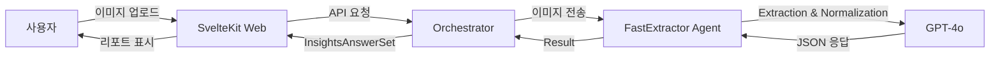

<!-- File: RUNBOOK.md -->
# 주주명부 분석기 (JuJu Shareholder Analyzer) 운영 가이드

## 목차
1. [개요](#개요)
2. [핵심 기능](#핵심-기능)
3. [기술 스택](#기술-스택)
4. [환경 변수](#환경-변수)
5. [로컬 개발](#로컬-개발)
6. [배포 (Vercel)](#배포-vercel)
7. [아키텍처](#아키텍처)

---

## 개요
**JuJu Shareholder Analyzer**는 주주명부 이미지를 업로드하면 AI가 자동으로 데이터를 추출, 정규화, 분석하여 **대주주 판별 및 실소유자(25% 이상 보유자) 식별** 정보를 제공하는 시스템입니다.

## 핵심 기능
1. **고속 추출 (Fast Track)**: 단일 AI 에이전트 패스로 주주명부에서 데이터를 빠르게 추출
2. **정밀 분석**: 
   - 주주명, 보유주식수, 지분율, 식별번호(주민/사업자번호) 추출
   - 식별번호(주민번호/사업자번호) 마스킹 해제 및 정규화
3. **인사이트 도출**:
   - 최대주주 자동 판별
   - 25% 이상 지분 보유자(실소유자 후보) 자동 식별 및 리스트업
   - 문서 신뢰도 판정
4. **결과 제공**: 분석 결과 리포트 UI 제공 및 데이터 다운로드

## 기술 스택
- **Frontend/Backend**: SvelteKit (TypeScript)
- **Deployment**: Vercel
- **AI Model**: OpenAI GPT-4o (Reasoning capability preferred)
- **Agent Framework**: Custom Orchestrator + @openai/agents
- **Styling**: TailwindCSS

---

## 환경 변수
`.env` 파일에 다음 변수들이 설정되어야 합니다.

| 변수명 | 설명 | 필수 여부 | 기본값 |
|--------|------|-----------|--------|
| `OPENAI_API_KEY` | OpenAI API 키 | ✅ | - |
| `OPENAI_MODEL` | 사용할 모델명 | ❌ | `gpt-4o` |
| `OPENAI_ORGANIZATION_ID` | OpenAI 조직 ID | ❌ | - |
| `OPENAI_PROJECT_ID` | OpenAI 프로젝트 ID | ❌ | - |

---

## 로컬 개발

1. **저장소 클론**
   ```bash
   git clone <repository_url>
   cd JuJu
   ```

2. **의존성 설치**
   ```bash
   npm install
   ```

3. **환경 변수 설정**
   `.env` 파일을 생성하고 API 키를 입력합니다.
   ```env
   OPENAI_API_KEY=sk-proj-....
   ```

4. **개발 서버 실행**
   ```bash
   npm run dev
   ```
   브라우저에서 `http://localhost:5173` 접속

---

## 배포 (Vercel)

이 프로젝트는 **Vercel**에 최적화되어 있습니다.

### Vercel CLI 배포
```bash
# Vercel 로그인
npx vercel login

# 배포 (Development/Preview)
npx vercel

# 프로덕션 배포
npx vercel --prod
```

### Vercel 대시보드 설정
배포 시 **Environment Variables**에 `OPENAI_API_KEY`를 반드시 등록해야 합니다.

> [!IMPORTANT]
> **Vercel 파일 시스템 제약 사항**:
> 버셀과 같은 서버리스 환경은 파일 시스템이 읽기 전용이기 때문에, 쓰기가 가능한 임시 디렉토리(`/tmp`)를 사용하도록 코드를 수정했습니다. (`storage.ts` 참조)
> `/tmp` 디렉토리의 데이터는 함수 실행 간에 유지되지 않으며, 배포 시마다 초기화되는 휘발성 데이터입니다. 영구 저장이 필요한 경우 외부 DB(Postgres, Redis 등) 연결이 필요합니다.

---

## 아키텍처 (Fast Track)



### 주요 컴포넌트
- **Orchestrator**: 전체 분석 프로세스 조정 및 세션 관리
- **FastExtractor**: Gatekeeping, Extraction, Normalization을 단일 패스로 수행하는 고성능 에이전트
- **AnalystService**: 정규화된 데이터를 기반으로 대주주 및 지분율 분석 로직 수행 (Deterministic)
