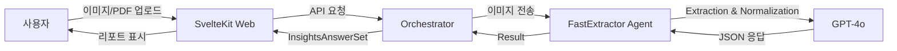
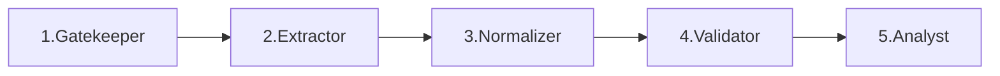

<!-- File: RUNBOOK.md -->
# 주주명부 분석기 (JuJu Shareholder Analyzer) v3.1.0 운영 가이드

## 목차
1. [개요](#개요)
2. [핵심 기능](#핵심-기능)
3. [기술 스택](#기술-스택)
4. [환경 변수](#환경-변수)
5. [로컬 개발](#로컬-개발)
6. [배포 (Vercel)](#배포-vercel)
7. [아키텍처](#아키텍처)
8. [트러블슈팅](#트러블슈팅)

---

## 개요
**JuJu Shareholder Analyzer**는 주주명부 이미지/PDF를 업로드하면 AI가 자동으로 데이터를 추출, 정규화, 분석하여 **대주주 판별 및 실소유자(25% 이상 보유자) 식별** 정보를 제공하는 엔터프라이즈급 시스템입니다.

## 핵심 기능
1. **이중 분석 모드**:
   - **Fast Track**: 단일 AI 에이전트로 빠른 추출 (저복잡도 문서용)
   - **Multi-Agent Pipeline**: 5단계 파이프라인으로 정밀 분석 (고복잡도 문서용)
2. **정밀 데이터 추출**:
   - 주주명, 보유주식수, 지분율, 식별번호(주민/사업자번호) 추출
   - 식별번호 마스킹 해제 및 정규화
   - 성명 심층 분석 (음운론적·어휘적·인구통계학적 적합성 판단)
3. **인사이트 도출**:
   - 최대주주 자동 판별
   - 25% 이상 지분 보유자(실소유자 후보) 자동 식별
   - 문서 신뢰도 판정 및 신선도 검증 (1년 초과 시 STALE 경고)
4. **HITL (Human-in-the-Loop)**: 데이터 불확실 시 사람의 확인 요청
5. **클라우드 스토리지**: Supabase를 통한 이미지·메타데이터 영구 저장
6. **Multi-Platform 지원**: Vercel, Netlify, Cloudflare, Railway, Render 자동 감지

## 기술 스택
| 영역 | 기술 |
|------|------|
| **Framework** | SvelteKit (Svelte 5 Runes Mode) |
| **Language** | TypeScript |
| **Styling** | TailwindCSS v4 |
| **Build** | Vite 7 |
| **AI Model** | OpenAI GPT-4o / GPT-4o-mini |
| **Agent Framework** | Custom Orchestrator + `@openai/agents` |
| **Storage** | Supabase Storage (이미지 + 메타데이터 JSON) |
| **Deployment** | Vercel (`@sveltejs/adapter-vercel`) |
| **Testing** | Vitest + Playwright |

---

## 환경 변수
`.env` 파일에 다음 변수들이 설정되어야 합니다. (`.env.example` 참조)

| 변수명 | 설명 | 필수 | 기본값 |
|--------|------|:----:|--------|
| `OPENAI_API_KEY` | OpenAI API 키 | ✅ | - |
| `OPENAI_MODEL` | 프로덕션 분석 모델 | ❌ | `gpt-4o` |
| `OPENAI_FAST_MODEL` | 고속 분석 모델 | ❌ | `gpt-4o-mini` |
| `OPENAI_ORGANIZATION_ID` | OpenAI 조직 ID | ❌ | - |
| `OPENAI_PROJECT_ID` | OpenAI 프로젝트 ID | ❌ | - |
| `USE_SUPABASE` | Supabase 스토리지 사용 여부 | ❌ | `false` (Vercel에서 자동 `true`) |
| `SUPABASE_URL` | Supabase 프로젝트 URL | ✅* | - |
| `SUPABASE_SERVICE_KEY` | Supabase Service Role Key | ✅* | - |
| `SUPABASE_ANON_KEY` | Supabase Anon Key (Fallback) | ❌ | - |

> \* Supabase 관련 변수는 `USE_SUPABASE=true` 또는 Vercel 배포 시 필수

---

## 로컬 개발

1. **저장소 클론**
   ```bash
   git clone https://github.com/kaura24/juju.git
   cd JuJu
   ```

2. **의존성 설치** (Node.js ≥ 20 필요)
   ```bash
   npm install
   ```

3. **환경 변수 설정**
   `.env.example`을 복사하여 `.env` 파일을 생성하고 API 키 입력:
   ```bash
   cp .env.example .env
   ```

4. **개발 서버 실행**
   ```bash
   npm run dev
   ```
   브라우저에서 `http://localhost:5173` 자동 접속

5. **개발 모드 자동 최적화**
   - 개발 환경에서는 자동으로 `gpt-4o-mini` 모델 사용 (비용 절감)
   - `.env`에 모델을 명시하면 해당 모델 우선 사용

---

## 배포 (Vercel)

### Vercel CLI 배포
```bash
npx vercel login
npx vercel          # Preview 배포
npx vercel --prod   # 프로덕션 배포
```

### Vercel 대시보드 필수 설정
1. **Environment Variables** 등록:
   - `OPENAI_API_KEY`
   - `SUPABASE_URL`
   - `SUPABASE_SERVICE_KEY` (⚠️ `SUPABASE_ANON_KEY`만 사용 시 RLS 에러 발생)

2. **Supabase 버킷 생성** (2개 필수):
   - `juju-images-public`: 이미지 파일용 (Public)
   - `juju-data`: 메타데이터 JSON용 (Private)
   - SQL Editor에서 `supabase_setup.sql` 실행 (RLS 정책)

> [!IMPORTANT]
> Vercel 서버리스 환경은 **읽기 전용 파일 시스템**, **60초 타임아웃**, **child process spawn 제한**이 있습니다. 시스템이 자동으로 감지하여 최적화합니다.

---

## 아키텍처

### Fast Track (단일 패스)

```mermaid
graph LR
    User[사용자] -->|이미지/PDF 업로드| Web[SvelteKit Web]
    Web -->|API 요청| Orch[Orchestrator]
    Orch -->|이미지 전송| FE[FastExtractor Agent]
    FE -->|Extraction & Normalization| LLM[GPT-4o]
    LLM -->|JSON 응답| FE
    FE -->|Result| Orch
    Orch -->|InsightsAnswerSet| Web
    Web -->|리포트 표시| User
```

### Multi-Agent Pipeline (5단계 정밀 분석)

```mermaid
graph LR
    GK[1.Gatekeeper] --> EX[2.Extractor]
    EX --> NM[3.Normalizer]
    NM --> VL[4.Validator]
    VL --> AN[5.Analyst]
```

### 주요 컴포넌트
| 파일 | 역할 |
|------|------|
| `orchestrator.ts` | 전체 분석 프로세스 조정 및 세션 관리 |
| `agents.ts` | AI 에이전트 정의 (Gatekeeper, Extractor, Normalizer, Analyst, FastExtractor) |
| `storage.ts` | 데이터 저장소 추상화 (로컬/Supabase) |
| `envCheck.ts` | 멀티 플랫폼 환경 감지 및 런타임 프로파일 |
| `sessionLock.ts` | 동시 실행 방지를 위한 세션 잠금 |
| `agentLogger.ts` | 에이전트 실행 로그 스트리밍 |
| `converter.ts` | PDF → 이미지 변환 (서버리스 최적화) |
| `supabase_storage.ts` | Supabase 스토리지 연동 |

### UI 컴포넌트
| 컴포넌트 | 역할 |
|----------|------|
| `UploadPanel.svelte` | 파일 업로드 및 분석 시작 |
| `RunLogStream.svelte` | 실시간 분석 로그 스트리밍 |
| `RunSummary.svelte` | 분석 결과 요약 표시 |
| `AnswerDisplay.svelte` | 인사이트 답변 표시 |
| `MajorShareholdersTable.svelte` | 대주주 테이블 |
| `HitlInbox.svelte` / `HitlDetail.svelte` | HITL 승인 요청 관리 |
| `DebugPanel.svelte` | 디버그 모니터링 (🐞) |

---

## 트러블슈팅

### PDF 변환 오류
- `pdfjs-dist` 버전을 **v3.11.174**로 유지 (v4.x는 Segfault 발생)
- `scripts/pdf-to-images.cjs`의 `console.log` 오버라이딩 코드 삭제 금지 (JSON 파싱 에러 방지)

### Vercel 파일 시스템 오류
- `/tmp`만 쓰기 가능 — `storage.ts`가 자동 처리
- `USE_SUPABASE=true` 시 모든 데이터가 클라우드에 저장되어 문제 없음

### 분석이 멈추는 경우 (queued 상태 유지)
- 세션 잠금 여부 확인 (`sessionLock.ts`)
- 브라우저 새로고침 후 재시도

---

**Last Updated**: 2026-02-11
**Version**: 3.1.0
